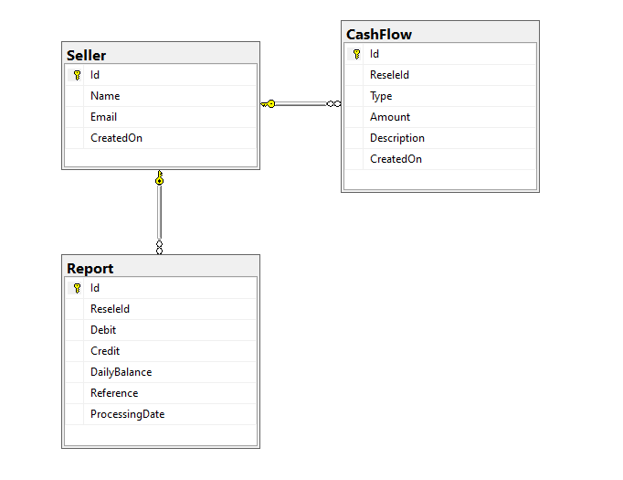

# ArquiteturaFluxodeCaixa

Projeto de arquitetura para Fluxo de Caixa

Desenvolvimento de uma solução para controle de Fluxo de Caixa.

## Tecnologias Utilizadas

- Microsoft Visual Studio Enterprise 2022
- C#
- Asp.Net WebApi
- Swagger
- XUnit
- Moq
- Dapper
- Sql Server / Sql Server Management Studio
- FluentValidation
- RESTful
- Application Insights
- Log Analytics
- Azure Monitor,
- Azure API Management
- Azure Functions

## Justificativa das Tecnologias Utilizadas

### Microsoft Visual Studio Enterprise 2022
: Esta IDE fornece um conjunto completo de ferramentas de desenvolvimento, depuração e testes que são essenciais para garantir a qualidade e a eficiência do código. Suas funcionalidades avançadas, como o IntelliSense, refatoração de código e integração com ferramentas de CI/CD, ajudam a manter o desenvolvimento ágil e de alta qualidade.

### C#
 C# é uma linguagem robusta e moderna que suporta desenvolvimento orientado a objetos, padrões de projeto e práticas SOLID. É ideal para construir aplicações escaláveis e de alta performance, características essenciais para atender às demandas de picos de requisições e alta disponibilidade.

### ASP.NET Web API
 Permite a construção de serviços RESTful eficientes e escaláveis que podem ser facilmente consumidos por diferentes clientes (web, mobile, etc.). A ASP.NET Web API é conhecida por sua performance e capacidade de lidar com alta carga de requisições, essencial para o serviço de consolidado diário.

### Swagger
 Ferramenta para documentação e teste de APIs RESTful. Facilita o desenvolvimento colaborativo e garante que as APIs sejam bem documentadas e fáceis de testar, o que é crucial para a manutenção e evolução do sistema.

### XUnit
 Framework de testes unitários que suporta a escrita de testes claros e concisos. Promove a adoção de boas práticas de TDD (Test-Driven Development), garantindo que o código esteja bem testado e livre de regressões.

### Moq
 Biblioteca de mocking que simplifica a criação de mocks para testes unitários, permitindo isolar e testar componentes individuais de forma eficaz. Ajuda a garantir que os testes sejam rápidos e confiáveis.

### Dapper
 Micro ORM (Object-Relational Mapper) que oferece uma maneira simples e eficiente de executar consultas SQL. É conhecido por sua performance superior em comparação com ORMs mais pesados, o que é ideal para operações de banco de dados de alta performance.

### SQL Server / SQL Server Management Studio
 Banco de dados relacional robusto e amplamente utilizado que oferece recursos avançados de gestão de dados, transações ACID e suporte para alta concorrência. O SQL Server Management Studio facilita a administração, otimização e monitoramento do banco de dados.

### FluentValidation
 Biblioteca para validação de modelos em .NET. Facilita a definição de regras de validação claras e reutilizáveis, ajudando a manter a consistência e integridade dos dados.

### RESTful
 Arquitetura de software que promove a interoperabilidade entre sistemas e a escalabilidade. Utilizando REST, os serviços são projetados para serem stateless, o que é essencial para garantir a alta disponibilidade e resiliência do sistema.

### Application Insights

- **Disponibilidade e Resiliência:** Monitora a disponibilidade do sistema e diagnostica falhas rapidamente.
- **Desempenho em Picos:** Avalia a latência e o tempo de resposta, ajudando a otimizar o sistema para gerenciar cargas elevadas.
- **Análise de Telemetria:** Fornece insights sobre o comportamento da aplicação para detectar e resolver problemas de desempenho.

### Log Analytics

- **Registro e Análise de Logs:** Coleta e analisa logs para diagnóstico e monitoramento contínuo.
- **Monitoramento de Performance:** Analisa dados para garantir que a perda de requisições não exceda 5% durante picos.
- **Alertas e Diagnóstico:** Configura alertas para problemas críticos e facilita a resolução de falhas.

### Azure Monitor

- **Visão Unificada:** Oferece uma visão consolidada da saúde do sistema, integrando dados de métricas, logs e eventos.
- **Gerenciamento de Recursos:** Monitora e ajusta a escala dos recursos para manter a disponibilidade e o desempenho.
- **Escalabilidade em Picos:** Ajuda a analisar e gerenciar o desempenho durante picos de carga para garantir a operação eficiente.

## Azure API Management
Para garantir a robustez e eficiência do sistema de controle de fluxo de caixa, especialmente em dias de pico com 500 requisições por segundo, utilizaremos o **Azure API Management**. Abaixo estão as razões para a escolha dessa solução, incluindo a utilização do sistema de cache:

- **Alta Disponibilidade e Resiliência:** O Azure API Management atua como um gateway de API que pode isolar o serviço de controle de lançamentos do sistema de consolidação diária. Em caso de falha do sistema de consolidação, o Azure API Management pode aplicar políticas de fallback e roteamento para manter o serviço de controle de lançamentos operacional, garantindo a continuidade do serviço.

- **Gerenciamento de Tráfego e Escalabilidade:** Durante picos de até 500 requisições por segundo, o Azure API Management fornece balanceamento de carga e escalabilidade automática. Isso assegura que o serviço possa lidar com altos volumes de tráfego sem degradação do desempenho.

- **Uso de Cache:** Nos dias de pico, utilizaremos o **Azure API Management Cache** para armazenar temporariamente respostas de API. O cache reduz a carga em sistemas backend e melhora a performance, permitindo que o sistema gerencie eficientemente o tráfego intenso e minimize a perda de requisições. O cache pode ser configurado para armazenar as respostas mais frequentes e críticas, reduzindo a necessidade de chamadas repetidas ao backend.

- **Monitoramento e Análise:** O Azure API Management fornece ferramentas integradas de monitoramento e análise que permitem rastrear o desempenho da API e identificar problemas em tempo real. Isso ajuda a garantir que a taxa de perda de requisições permaneça dentro do limite de 5% e permite ajustes rápidos para otimizar o desempenho.

- **Segurança e Controle:** A plataforma oferece recursos avançados de segurança e controle, como autenticação, autorização e proteção contra ataques DDoS, garantindo a integridade e a proteção do sistema mesmo durante picos de carga.

A utilização do **Azure API Management**, com seu sistema de cache, assegura que o sistema de controle de fluxo de caixa mantenha alta disponibilidade, escalabilidade e desempenho eficiente, mesmo durante períodos de alta demanda.

## Azure Functions para Consolidação de Dados
Para otimizar o desempenho e a eficiência do sistema de controle de fluxo de caixa, utilizaremos uma **Azure Function** que executa a consolidação dos dados da tabela `CashFlow` na tabela `Report` durante a madrugada. A seguir, detalhamos a justificativa para essa abordagem:

- **Eficiência Operacional:** A **Azure Function** será configurada para rodar de madrugada, quando a carga no sistema é menor. Esta função irá consolidar os dados da tabela `CashFlow` e armazená-los na tabela `Report`. Consolidar dados periodicamente ajuda a reduzir o volume de dados processados em tempo real e melhora a eficiência do sistema.

- **Desempenho em Consultas:** Ao consolidar os dados na tabela `Report`, o sistema evita a necessidade de realizar a consolidação em tempo real durante consultas para datas passadas. Isso reduz a carga de processamento e melhora o tempo de resposta das consultas, pois os dados já consolidados estão prontos para serem recuperados diretamente da tabela `Report`.

- **Redução de Carga em Tempo Real:** Sem a necessidade de consolidar dados em tempo real, o sistema reduz a carga sobre os recursos durante o horário de pico e melhora a experiência do usuário ao fornecer respostas rápidas e consistentes para consultas.

- **Automação e Escalabilidade:** A **Azure Function** oferece uma solução altamente escalável e automatizada para a consolidação de dados. Ela pode ser facilmente ajustada para lidar com variações na quantidade de dados, garantindo que a consolidação seja realizada de forma eficiente independentemente do volume de dados.

- **Custo-Efetividade:** Executar a consolidação durante a madrugada, quando os custos de computação podem ser menores, otimiza os custos operacionais. A **Azure Function** é uma opção de baixo custo que permite executar a tarefa de consolidação de forma eficiente sem a necessidade de manter recursos dedicados constantemente.

- **Simplicidade e Manutenção:** Usar uma **Azure Function** simplifica a arquitetura do sistema ao delegar a tarefa de consolidação a um componente separado. Isso facilita a manutenção e o gerenciamento, pois a função pode ser ajustada e atualizada sem afetar diretamente os componentes principais do sistema.

Essa abordagem garante que o sistema de controle de fluxo de caixa funcione de maneira eficiente, escalável e econômica, proporcionando um desempenho otimizado nas consultas de dados históricos e aliviando a carga durante períodos de alta demanda.


## Padrões de Design
- Domain Driven Design(DDD)
- Domain Notifications
- Inversion of Control (IoC ou inversão de controle)
- Repository Pattern (com Dapper)
- [Options pattern](https://learn.microsoft.com/en-us/aspnet/core/fundamentals/configuration/options?view=aspnetcore-8.0)
- [Chain of Responsibility (.Net8 Middleware)](https://learn.microsoft.com/pt-br/aspnet/core/fundamentals/middleware/?view=aspnetcore-8.0)

### Domain Driven Design (DDD)
O DDD permite que a complexidade da lógica de negócios seja gerenciada de forma mais eficaz, organizando o código em torno dos domínios e subdomínios da aplicação. Isso facilita a comunicação entre os desenvolvedores e os especialistas no domínio, garantindo que a solução atenda de forma precisa aos requisitos de negócios.

### Domain Notifications
Para o sistema de controle de fluxo de caixa, utilizaremos o padrão **Domain Notifications** para validação de modelos em vez de lançar exceções. Aqui estão os motivos:

##### 1. **Resiliência e Continuidade**
- **Descrição:** Permite que o sistema continue processando sem interrupções, mesmo se houver erros de validação.
- **Vantagem:** Mantém o serviço operacional e evita interrupções, essencial quando o sistema de consolidação pode enfrentar falhas.

#### 2. **Feedback Detalhado**
- **Descrição:** Acumula e apresenta todos os erros de validação em um único ponto.
- **Vantagem:** Oferece um feedback mais completo e claro para o comerciante corrigir problemas de forma eficiente.

#### 3. **Melhoria na Experiência do Usuário**
- **Descrição:** Fornece mensagens de erro específicas e contextuais.
- **Vantagem:** Melhora a compreensão dos erros pelo usuário, facilitando a correção.

#### 4. **Gestão Eficiente das Regras de Negócio**
- **Descrição:** Centraliza a lógica de validação e regras de negócios.
- **Vantagem:** Simplifica a manutenção e a adaptação das regras de validação.

#### 5. **Escalabilidade e Performance**
- **Descrição:** Trata erros de forma estruturada e evita sobrecarga de exceções.
- **Vantagem:** Ajuda a manter a performance e a disponibilidade, mesmo em picos de carga com até 500 requisições por segundo.

### Inversion of Control (IoC)
IoC promove a flexibilidade e testabilidade do código ao permitir a injeção de dependências em vez de instanciá-las diretamente. Isso facilita a implementação de testes unitários e promove a adesão aos princípios SOLID, resultando em um código mais modular e de fácil manutenção.

### Repository Pattern (com Dapper)
O Repository Pattern abstrai o acesso aos dados, permitindo que a lógica de negócios interaja com uma camada de repositório em vez de acessar diretamente o banco de dados. Isso promove a separação de preocupações e facilita a implementação de testes unitários. O uso do Dapper, por ser um micro ORM leve, garante alta performance nas operações de banco de dados.

### Options Pattern
O Options Pattern em .NET fornece uma maneira elegante de gerenciar configurações fortemente tipadas. Isso facilita a manutenção e a validação das configurações, promovendo um código mais limpo e organizado.

### Chain of Responsibility (Middleware no .NET 8)
O padrão Chain of Responsibility, implementado através de middleware no .NET 8, permite a construção de pipelines de processamento de requisições de forma modular e flexível. Cada middleware pode ser responsável por uma parte específica do processamento, como autenticação, logging, manipulação de erros, etc., promovendo uma arquitetura limpa e extensível.

## Casos de Uso
[Casos de Uso](CasosDeUso/README.md)

## Desenho da solução
 <br><br>

###Modelagem do Banco de dados

 <br><br>


## Solução
A solução foi organizada em pastas conforme a figura abaixo.

 <br><br>

- "01 WebApi" estão a Apis que disponibiliza as informações do fluxo de caixa utilizado no projeto MVC.
- "02 Domain", "03 Application", 04 Repository", "05 IoC" são as camadas da aplicação utilizados nos projetos MVC e WebApi
- "06 Database" está o projeto de banco de dados.
   Com este projeto é possível ver facilmente ver as ultimas alterações, comparar os objetos do banco de dados, gerar scripts para alteração e caso necessário fazer updates 

 <br><br>

- "07 Tests" estão os testes de unidades das classes do sistema


Em "ModelingProject podemos ver o diagrama de dependências do projeto.
Utilizamos Inversion of Control e DDD para temos os seguintes benefícios:

1) Baixo acoplamento no código
2) Facilidade de manutenção e evolução do código
3) Facilidade para testar o código
4) Segregação das responsabilidades
5) Compartilhamento de conhecimento com outros desenvolvedores

 <br><br>

Utilizamos a micro ORM dapper ao invés do EntityFramework pois o dapper é performático no cenário de pico de 500 inclusões por segundo.

Criamos trs WebApis (lançamentos de crédito e débito CRUD do comerciante e outra para o relatório)
Assim caso ocorra alguma indisponibilidade na api do relatório o sistema de lançamentos continuará funcionando.

No sistema de relatório criamos duas procedures para melhorar a performance do banco de dados e um indice ('IX_CashFlow_CreatedOn') na tabela 'CashFlow' coluna 'CreatedOn'

## Execução da aplicação
Para executar o projeto segui as seguintes etapas
1) Abra o "Sql Server Management Studio" e crie uma nova consulta em branco   
   Entre na pasta "src\EmpXpo.Accounting.Database\Scripts"
   Utilize o arquivo "banco.sql" para criar o banco de dados, tabelas e procedure

3) Pegue a string de conexão para o banco "DbAccounting" criado anteriormente pelo script

4) Abra a solução src/EmpXpo.Accounting.sln com o Visual Studio

5) Dentro do "Visual Studio" entre nos projetos "01 WebApi/EmpXpo.Accounting.CashFlowApi" e "01 WebApi\EmpXpo.Accounting.CashFlowReportApi"   
   Altere a ConnectionStrings que está no arquivo appsettings.Development.json para ConnectionStrings da sua maquina
   
   ```
   "ConnectionStrings": {
		"cnSqlDbAccounting": "Sua ConnectionString aqui!"
	}
   ```
   
8) Ajuste o "Startup Projects" do Visual Studio conforme a figura abaixo:
   Apos esta configuração tecle no botão F5 para executar a aplicação
     <br><br>

## Testes
Para executar os testes de unidade dentro do Visual Studio acesse a pasta "07 Tests/CashFlowTests"

Clique com o botão direito no projeto "CashFlowTests" click em "Run Tests"

