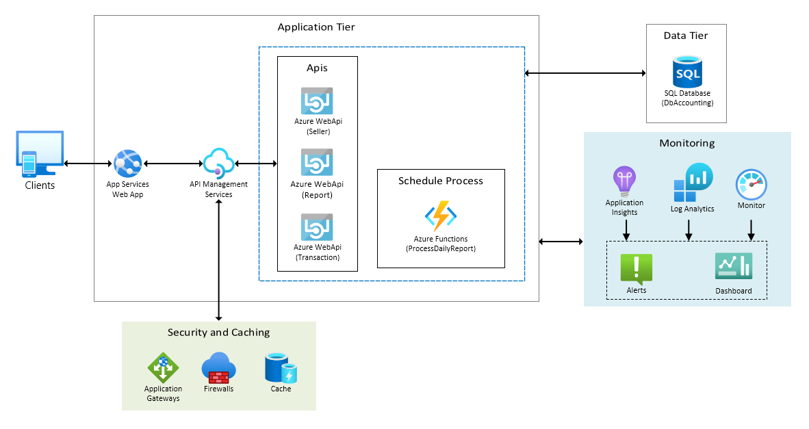
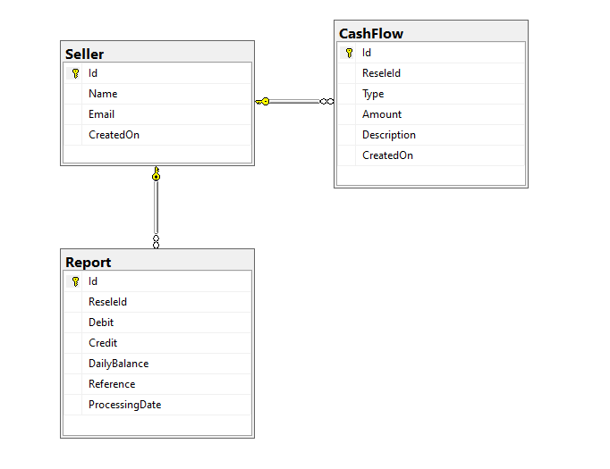
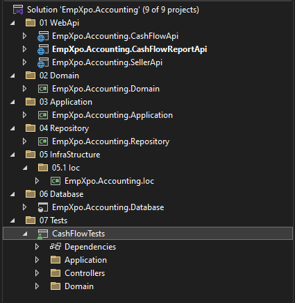
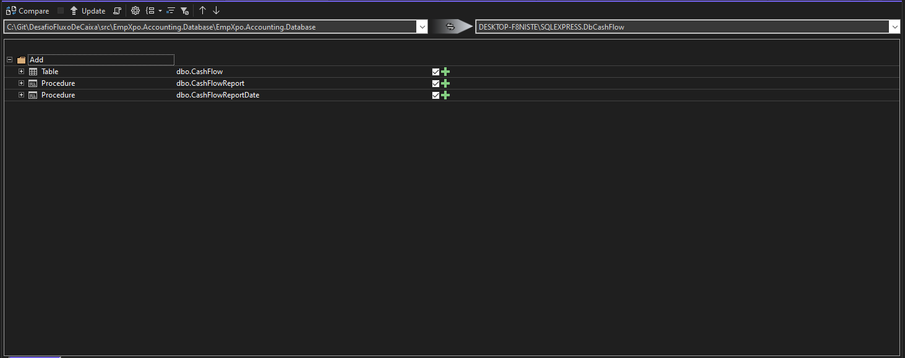
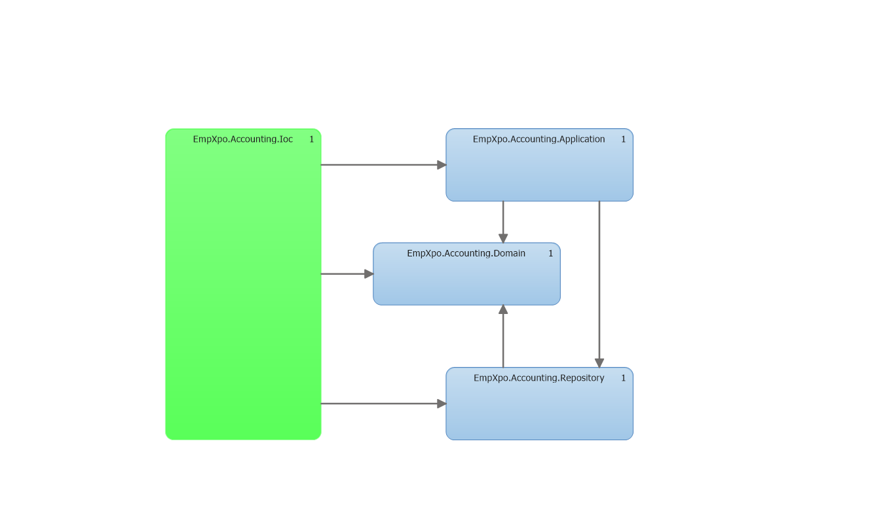
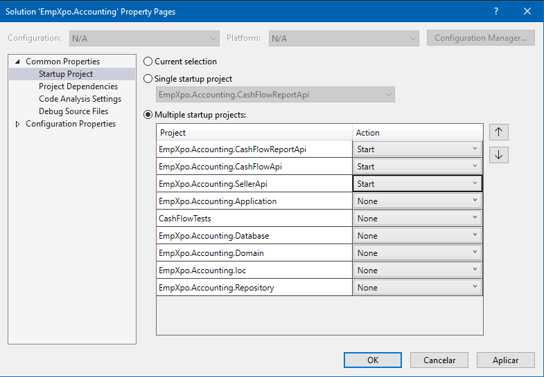

# ArquiteturaFluxodeCaixa

Projeto de arquitetura para Fluxo de Caixa

Desenvolvimento de uma solução para controle de Fluxo de Caixa.

## Tecnologias Utilizadas

- Microsoft Visual Studio Enterprise 2022
- C#
- Asp.Net WebApi
- Asp.Net MVC
- Swagger
- XUnit
- Moq
- Dapper
- Sql Server / Sql Server Management Studio
- FluentValidation
- RESTful

## Justificativa das Tecnologias Utilizadas

### Microsoft Visual Studio Enterprise 2022
**Motivo**: Esta IDE fornece um conjunto completo de ferramentas de desenvolvimento, depuração e testes que são essenciais para garantir a qualidade e a eficiência do código. Suas funcionalidades avançadas, como o IntelliSense, refatoração de código e integração com ferramentas de CI/CD, ajudam a manter o desenvolvimento ágil e de alta qualidade.

### C#
**Motivo**: C# é uma linguagem robusta e moderna que suporta desenvolvimento orientado a objetos, padrões de projeto e práticas SOLID. É ideal para construir aplicações escaláveis e de alta performance, características essenciais para atender às demandas de picos de requisições e alta disponibilidade.

### ASP.NET Web API
**Motivo**: Permite a construção de serviços RESTful eficientes e escaláveis que podem ser facilmente consumidos por diferentes clientes (web, mobile, etc.). A ASP.NET Web API é conhecida por sua performance e capacidade de lidar com alta carga de requisições, essencial para o serviço de consolidado diário.

### ASP.NET MVC
**Motivo**: Facilita a construção de aplicações web robustas seguindo o padrão MVC, separando as preocupações e promovendo a manutenção e escalabilidade do código. Ideal para a criação de interfaces de usuário (UI) ricas e interativas.

### Swagger
**Motivo**: Ferramenta para documentação e teste de APIs RESTful. Facilita o desenvolvimento colaborativo e garante que as APIs sejam bem documentadas e fáceis de testar, o que é crucial para a manutenção e evolução do sistema.

### XUnit
**Motivo**: Framework de testes unitários que suporta a escrita de testes claros e concisos. Promove a adoção de boas práticas de TDD (Test-Driven Development), garantindo que o código esteja bem testado e livre de regressões.

### Moq
**Motivo**: Biblioteca de mocking que simplifica a criação de mocks para testes unitários, permitindo isolar e testar componentes individuais de forma eficaz. Ajuda a garantir que os testes sejam rápidos e confiáveis.

### Dapper
**Motivo**: Micro ORM (Object-Relational Mapper) que oferece uma maneira simples e eficiente de executar consultas SQL. É conhecido por sua performance superior em comparação com ORMs mais pesados, o que é ideal para operações de banco de dados de alta performance.

### SQL Server / SQL Server Management Studio
**Motivo**: Banco de dados relacional robusto e amplamente utilizado que oferece recursos avançados de gestão de dados, transações ACID e suporte para alta concorrência. O SQL Server Management Studio facilita a administração, otimização e monitoramento do banco de dados.

### FluentValidation
**Motivo**: Biblioteca para validação de modelos em .NET. Facilita a definição de regras de validação claras e reutilizáveis, ajudando a manter a consistência e integridade dos dados.

### RESTful
**Motivo**: Arquitetura de software que promove a interoperabilidade entre sistemas e a escalabilidade. Utilizando REST, os serviços são projetados para serem stateless, o que é essencial para garantir a alta disponibilidade e resiliência do sistema.


## Padrões de Design
- Domain Driven Design(DDD)
- Inversion of Control (IoC ou inversão de controle)
- Model-View-ViewModel (MVVM)
- Repository Pattern (com Dapper)
- [Options pattern](https://learn.microsoft.com/en-us/aspnet/core/fundamentals/configuration/options?view=aspnetcore-8.0)
- [Chain of Responsibility (.Net8 Middleware)](https://learn.microsoft.com/pt-br/aspnet/core/fundamentals/middleware/?view=aspnetcore-8.0)

### Domain Driven Design (DDD)
O DDD permite que a complexidade da lógica de negócios seja gerenciada de forma mais eficaz, organizando o código em torno dos domínios e subdomínios da aplicação. Isso facilita a comunicação entre os desenvolvedores e os especialistas no domínio, garantindo que a solução atenda de forma precisa aos requisitos de negócios.

### Inversion of Control (IoC)
IoC promove a flexibilidade e testabilidade do código ao permitir a injeção de dependências em vez de instanciá-las diretamente. Isso facilita a implementação de testes unitários e promove a adesão aos princípios SOLID, resultando em um código mais modular e de fácil manutenção.

### Model-View-ViewModel (MVVM)
MVVM separa claramente a lógica de apresentação da lógica de negócios, permitindo um desenvolvimento mais organizado e testável. Esse padrão é especialmente útil para aplicações com interfaces ricas, como no ASP.NET MVC, garantindo que a lógica de UI seja mantida separada do restante do código.

### Repository Pattern (com Dapper)
O Repository Pattern abstrai o acesso aos dados, permitindo que a lógica de negócios interaja com uma camada de repositório em vez de acessar diretamente o banco de dados. Isso promove a separação de preocupações e facilita a implementação de testes unitários. O uso do Dapper, por ser um micro ORM leve, garante alta performance nas operações de banco de dados.

### Options Pattern
O Options Pattern em .NET fornece uma maneira elegante de gerenciar configurações fortemente tipadas. Isso facilita a manutenção e a validação das configurações, promovendo um código mais limpo e organizado.

### Chain of Responsibility (Middleware no .NET 8)
O padrão Chain of Responsibility, implementado através de middleware no .NET 8, permite a construção de pipelines de processamento de requisições de forma modular e flexível. Cada middleware pode ser responsável por uma parte específica do processamento, como autenticação, logging, manipulação de erros, etc., promovendo uma arquitetura limpa e extensível.

## Desenho da solução
 <br><br>

###Modelagem do Banco de dados
 <br><br>


## Solução
A solução foi organizada em pastas conforme a figura abaixo.

 <br><br>

- "00 WebApp" está a aplicação principal feita em Asp.Net MVC aonde o cliente poderá fazer o lançamento de credito e debito e visualizar o relatório consolidado do dia
- "01 WebApi" estão a Apis que disponibiliza as informações do fluxo de caixa utilizado no projeto MVC.
- "02 Domain", "03 Application", 04 Repository", "05 IoC" são as camadas da aplicação utilizados nos projetos MVC e WebApi
- "06 Database" está o projeto de banco de dados.
   Com este projeto é possível ver facilmente ver as ultimas alterações, comparar os objetos do banco de dados, gerar scripts para alteração e caso necessário fazer updates 

 <br><br>

- "07 Tests" estão os testes de unidades das classes do sistema


Em "ModelingProject podemos ver o diagrama de dependências do projeto.
Utilizamos Inversion of Control e DDD para temos os seguintes benefícios:

1) Baixo acoplamento no código
2) Facilidade de manutenção e evolução do código
3) Facilidade para testar o código
4) Segregação das responsabilidades
5) Compartilhamento de conhecimento com outros desenvolvedores

 <br><br>

Utilizamos a micro ORM dapper ao invés do EntityFramework pois o dapper é performático no cenário de pico de 500 inclusões por segundo.

Criamos uma aplicação WebMvc para o cliente fazer os lançamentos de crédito e débito e duas WebApi uma para os lançamento e outra para relatório
Assim caso ocorra alguma indisponibilidade na api do relatório o sistema de lançamentos continuará funcionando.

No sistema de relatório criamos duas procedures para melhorar a performance do banco de dados e um indice ('Ind_CashFlow_1') na tabela 'CashFlow' coluna 'CreatedOn'


## Execução da aplicação
Para executar o projeto segui as seguintes etapas
1) Abra o "Sql Server Management Studio" e crie uma nova consulta em branco   
   Entre na pasta "src\EmpXpo.Accounting.Database\Scripts"
   Utilize o arquivo "banco.sql" para criar o banco de dados, tabelas e procedure

3) Pegue a string de conexão para o banco "DbCashFlow" criado anteriormente pelo script

4) Abra a solução src/EmpXpo.Accounting.sln com o Visual Studio

5) Dentro do "Visual Studio" entre nos projetos "01 WebApi/EmpXpo.Accounting.CashFlowApi" e "01 WebApi\EmpXpo.Accounting.CashFlowReportApi"   
   Altere a ConnectionStrings que está no arquivo appsettings.Development.json para ConnectionStrings da sua maquina
   
   ```
   "ConnectionStrings": {
		"cnSqlDbAccounting": "Sua ConnectionString aqui!"
	}
   ```

7) Caso a aplicação "00 WebApp/EmpXpo.Accounting.WebApp" não encontre o endereço das Apis

   Verifique o enereço de execução dos projetos "01 WebApi/EmpXpo.Accounting.CashFlowApi" e "01 WebApi\EmpXpo.Accounting.CashFlowReportApi"
   no arquivo "Properties/launchSettings.json"

   Coloque esse novo endereço no projeto "00 WebApp/EmpXpo.Accounting.WebApp"
   no arquivo "appsettings.Development.json"
   
   
   ```
    "cnCashFlowReportApi": "https://localhost:7255/CashFlowReport",
	"cnCashFlowApi": "https://localhost:7162/CashFlow",
   ```
   
8) Ajuste o "Startup Projects" do Visual Studio conforme a figura abaixo:
    A aplicação MVC deve  iniciar após as WebApis

     <br><br>

## Testes
Para executar os testes de unidade dentro do Visual Studio acesse a pasta "07 Tests/CashFlowTests"

Clique com o botão direito no projeto "CashFlowTests" click em "Run Tests"

